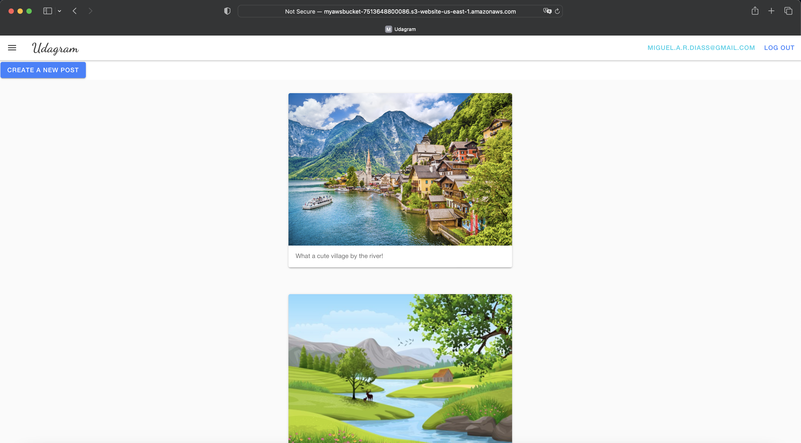

# Hosting a Full-Stack Application

# Udagram

In this application, you are able to create a user, login and add posts to it.
This application is hosted on Amazon Web Services S3 Static bucket. It talks to an API for data fetching and saving (which in itself is hosted on Amazon RDS along with Elastic Beanstalk). Another S3 Bucket is used to save media content.

You can visit my own deployed version [here](http://myawsbucket-7513648800086.s3-website-us-east-1.amazonaws.com).

### Current Hosted version

Please refer to the [Screenshots](./Screenshots/) for more pictures on the status of the different moving parts of the app.

### Installation

Provision the necessary AWS services needed for running the application:

1. In AWS, provision a publicly available RDS database running Postgres. [DB Link](https://mydbinstance.cuc17jgrmae4.us-east-1.rds.amazonaws.com)
1. In AWS, provision a s3 bucket for hosting the uploaded files. URN: arn:aws:s3:::udagramposts-bucket
1. Export the ENV variables needed or use a package like [dotnev](https://www.npmjs.com/package/dotenv)/.
1. From the root of the repo, navigate udagram-api folder `cd starter/udagram-api` to install the node_modules `npm install`. After installation is done start the api in dev mode with `npm run dev`.
1. Without closing the terminal in step 1, navigate to the udagram-frontend `cd starter/udagram-frontend` to intall the node_modules `npm install`. After installation is done start the api in dev mode with `npm run start`.

## Testing

This project contains two different test suite: unit tests and End-To-End tests(e2e). Follow these steps to run the tests.

1. `cd starter/udagram-frontend`
1. `npm run test`
1. `npm run e2e`

There are no Unit test on the back-end

### Unit Tests:

Unit tests are using the Jasmine Framework.

### End to End Tests:

The e2e tests are using Protractor and Jasmine.

## Built With

- [Angular](https://angular.io/) - Single Page Application Framework
- [Node](https://nodejs.org) - Javascript Runtime
- [Express](https://expressjs.com/) - Javascript API Framework

## License

[License](LICENSE.txt)
